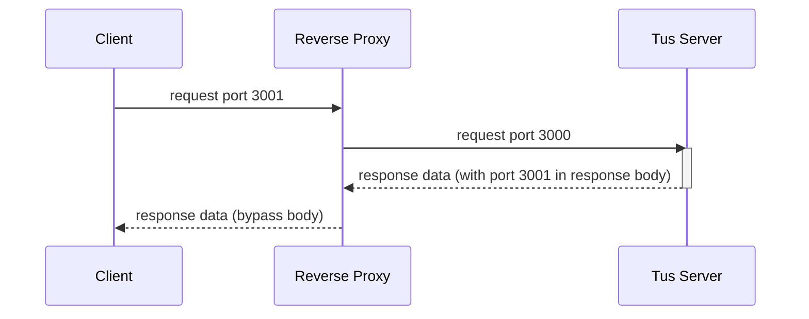

# WTF
[tus-node-server](https://github.com/tus/tus-node-server) that hosted behind a reverse proxy.

# Network scheme



# Startup

```sh
# NOTE: add `127.0.0.1 sfhs.localhost` to you /etc/hosts if need

# terminal 1
cd reverse_proxy && docker compose up

# terminal 2
node index.mjs

# terminal 3
node upload.mjs
```
